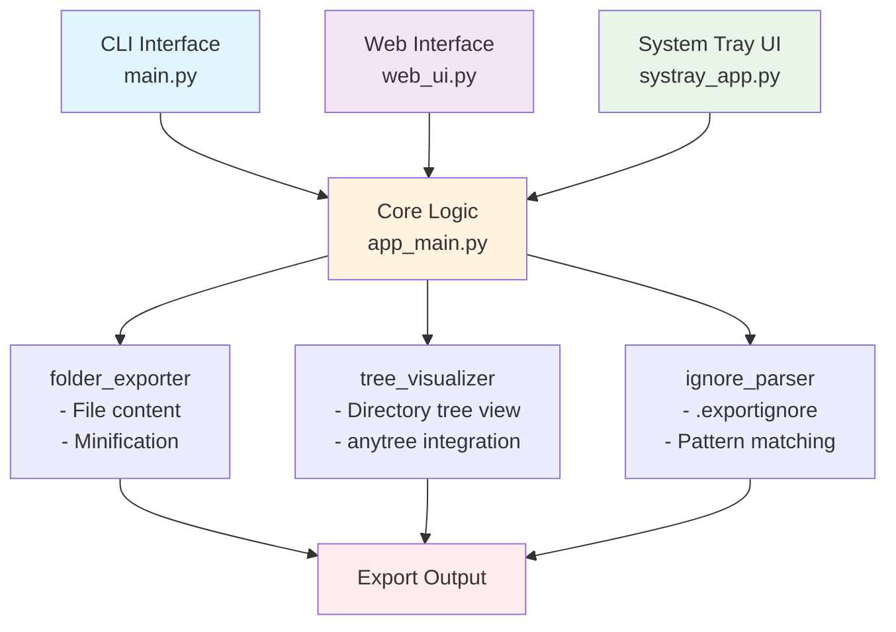
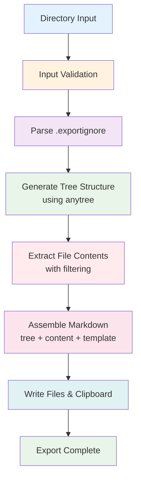
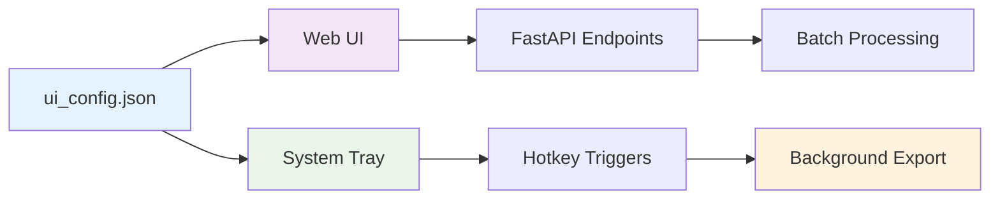
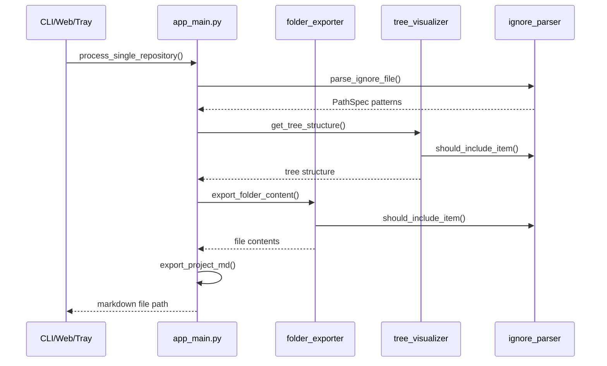

# Architecture

## Overview

Export-for-AI implements a multi-interface architecture supporting CLI, web UI, and system tray interactions for exporting code repositories to AI-friendly formats.

## Component Architecture



## Data Flow

### Export Process



### Configuration Flow



## Core Components

### Export Engine (`src/export_for_ai/`)
- **folder_exporter.py**: File content extraction with ignore pattern support
- **tree_visualizer.py**: Directory tree visualization using anytree
- **ignore_parser.py**: .exportignore file parsing with pathspec
- **main.py**: CLI interface and export orchestration

### Interface Layer
- **app_main.py**: Batch processing coordinator
- **web_ui.py**: FastAPI server for web interface
- **systray_app.py**: System tray integration with global hotkeys

### Frontend
- **templates/index.html**: Single-page web application
- Real-time log streaming via Server-Sent Events
- Repository and asset management interface

## Key Design Patterns

### Separation of Concerns
- Export logic isolated from interface implementations
- Configuration management centralized
- Error handling consistent across interfaces

### Plugin-like Architecture
- Each interface (CLI, Web, Systray) can operate independently
- Shared core logic through app_main.py
- Modular component design

### Streaming Architecture
- Real-time log output for web interface
- Asynchronous processing for non-blocking operations
- Background thread execution for system tray

## Dependencies

### Core Dependencies
- **pathspec**: .exportignore pattern matching
- **anytree**: Directory tree structure generation
- **pyyaml**: Configuration file parsing
- **pyperclip**: System clipboard integration

### Interface Dependencies
- **FastAPI/uvicorn**: Web server framework
- **pystray**: System tray integration
- **pynput**: Global hotkey support
- **Pillow**: Icon image processing

## Configuration Management

### ui_config.json Structure
```json
{
  "export_destination": "string",
  "repositories": ["array", "of", "paths"],
  "assets_to_copy": ["array", "of", "assets"]
}
```

### Runtime Configuration
- Default ignore patterns in ignore_parser.py
- Project-specific .exportignore files
- Template sections via config.yaml

## Error Handling Strategy

### Graceful Degradation
- Missing icons fallback to generated placeholders
- Encoding errors handled with descriptive messages
- Network failures in web UI display user-friendly errors

### Logging Strategy
- Structured logging throughout all components
- Crash logging for system tray application
- Real-time log streaming for web interface

## Output Structure

### Generated File Hierarchy

```mermaid
graph TD
    Root[exported-from-{folder_name}/] --> Main[project-{folder_name}.md<br/>📄 Main export file]
    Root --> Tree[project_structure.txt<br/>🌳 Tree structure only]  
    Root --> Contents[project_contents.md<br/>📝 Code contents only]
    
    Main --> Sections[Combined Sections:<br/>- Previous step<br/>- The goal<br/>- Design Philosophy<br/>- Solution Tree View<br/>- Entire Solution Code]
    
    style Root fill:#e3f2fd
    style Main fill:#ffebee
    style Tree fill:#f3e5f5
    style Contents fill:#e8f5e8
    style Sections fill:#fff3e0
```

## Processing Sequence

### Export Flow Sequence

