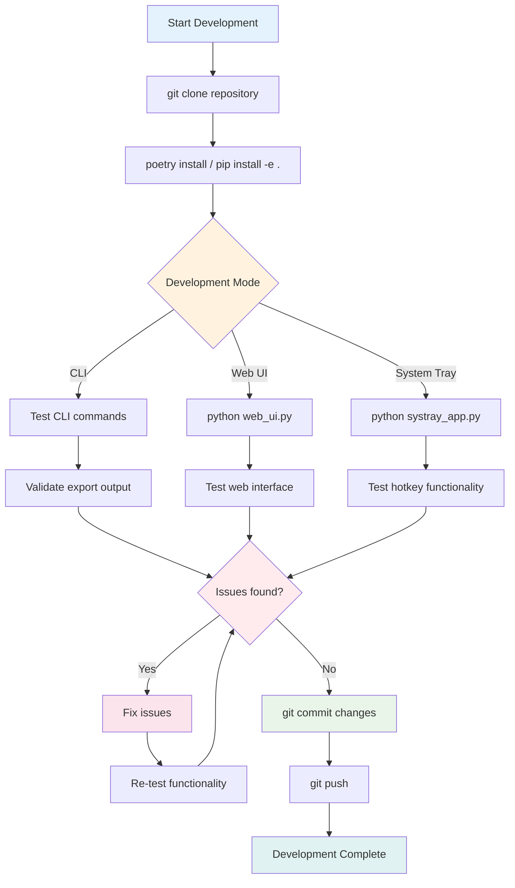

# Development Guide

## Development Environment Setup

### Prerequisites
- Python 3.10+
- Poetry (recommended) or pip
- Git

### Installation

```bash
# Clone repository
git clone https://github.com/KindEmily/export-for-ai.git
cd export-for-ai

# Install dependencies
poetry install
# OR
python -m pip install -e .

# Verify installation
export-for-ai --help
efa --help
```

### Running in Development Mode

```bash
# CLI development
python -m export_for_ai test_project/

# Web UI development
python web_ui.py
# Navigate to http://127.0.0.1:8000

# System tray development
python systray_app.py
```

### Development Workflow



## Project Structure

```
export-for-ai/
├── src/export_for_ai/          # Core package
│   ├── __init__.py
│   ├── main.py                 # CLI interface
│   ├── folder_exporter.py      # File content extraction
│   ├── tree_visualizer.py      # Directory tree generation
│   ├── ignore_parser.py        # .exportignore handling
│   └── section_manager.py      # Template sections
├── app_main.py                 # Batch processing
├── web_ui.py                   # FastAPI web server
├── systray_app.py              # System tray application
├── templates/
│   └── index.html              # Web UI frontend
├── assets/
│   └── icon.png               # Application icon
├── config.yaml                 # Template configuration
├── ui_config.json             # Runtime configuration
├── pyproject.toml             # Poetry configuration
├── requirements.txt           # Pip dependencies
└── docs/                      # Documentation
```

## Development Workflow

### Code Style Guidelines

#### Python Code
- Follow PEP 8 conventions
- Use type hints where appropriate
- Document complex functions with docstrings
- Handle errors gracefully with appropriate logging

#### JavaScript/HTML
- Use modern ES6+ syntax
- Follow consistent indentation (2 spaces)
- Use semantic HTML structure
- Implement responsive design patterns

### Testing Strategy

#### Manual Testing
```bash
# Test CLI functionality
export-for-ai test_project/

# Test web UI
python web_ui.py
# Test all interface features

# Test system tray
python systray_app.py
# Test hotkeys: Ctrl+Shift+Q, Ctrl+Shift+E
```

#### Test Data Setup
```bash
# Create test directory structure
mkdir test_project
echo "print('hello')" > test_project/test.py
echo "*.log" > test_project/.exportignore
```

### Debugging

#### Enable Debug Logging
```python
# In any module
import logging
logging.basicConfig(level=logging.DEBUG)
```

#### Web UI Debugging
```bash
# Start with debug mode
python web_ui.py
# Check browser console for JavaScript errors
# Monitor server logs in terminal
```

#### System Tray Debugging
```bash
# Check crash logs
cat systray_crash.log

# Monitor system tray output
python systray_app.py
# Check console for log messages
```

## Architecture Components

### Core Export Engine

#### Adding New Export Features
1. Modify `folder_exporter.py` for content processing
2. Update `tree_visualizer.py` for structure visualization
3. Extend `ignore_parser.py` for new pattern types
4. Test with various repository structures

#### Example: Adding File Size Information
```python
# In folder_exporter.py
def get_file_info(file_path):
    stat = os.stat(file_path)
    return {
        'size': stat.st_size,
        'modified': stat.st_mtime
    }
```

### Interface Development

#### Web UI Modifications
1. Update `templates/index.html` for UI changes
2. Modify `web_ui.py` for API endpoints
3. Test real-time streaming functionality
4. Ensure responsive design compatibility

#### System Tray Enhancements
1. Modify `systray_app.py` for new features
2. Update icon and menu options
3. Test hotkey combinations
4. Handle system integration edge cases

### Configuration Management

#### Adding New Configuration Options
1. Update `Config` model in `web_ui.py`
2. Modify `ui_config.json` structure
3. Update web UI form handling
4. Test configuration persistence

```python
# Example: Adding new config option
class Config(BaseModel):
    export_destination: str
    repositories: List[str]
    assets_to_copy: Optional[List[str]] = []
    new_option: Optional[str] = ""  # New configuration field
```

## Common Development Tasks

### Adding New Ignore Patterns
```python
# In ignore_parser.py
DEFAULT_IGNORE_PATTERNS = [
    # ... existing patterns ...
    'new_pattern/',
    '*.new_extension',
]
```

### Modifying Export Format
```python
# In main.py or app_main.py
def export_project_md(tree_structure, folder_contents, export_dir, folder_name):
    # Modify template structure
    dynamic_sections = """
    # Custom Section
    New content here
    """
```

### Adding New Web API Endpoints
```python
# In web_ui.py
@app.post("/api/new-endpoint")
async def new_endpoint(request: CustomModel) -> dict:
    # Implementation
    return {"status": "success"}
```

### System Tray Menu Extensions
```python
# In systray_app.py
menu = pystray.Menu(
    pystray.MenuItem("Open UI", open_ui, default=True),
    pystray.MenuItem("Run Export", on_export_activate),
    pystray.MenuItem("New Option", new_function),  # New menu item
    pystray.MenuItem("Quit", on_quit)
)
```

## Performance Considerations

### Memory Management
- Process large repositories in chunks
- Clean up temporary directories promptly
- Use generators for large file processing

### Asynchronous Operations
- Web UI uses asyncio for non-blocking operations
- System tray operations run in background threads
- File I/O operations use appropriate async patterns

### Resource Cleanup
```python
# Ensure proper cleanup
try:
    export_dir = create_export_directory(path)
    # ... processing ...
finally:
    if export_dir and os.path.exists(export_dir):
        shutil.rmtree(export_dir)
```

## Security Considerations

### Path Validation
```python
# Always validate and sanitize paths
def validate_directory(directory_path: str) -> bool:
    if not os.path.isdir(directory_path):
        return False
    # Additional security checks
    return True
```

### File Access Control
- Respect file system permissions
- Handle permission errors gracefully
- Avoid accessing sensitive system directories

### Web Interface Security
- Validate all user inputs
- Sanitize file paths from API requests
- Implement appropriate CORS policies if needed

## Deployment Considerations

### Building Distribution
```bash
# Using Poetry
poetry build

# Using pip
python -m build
```

### System Integration
- Test system tray functionality across platforms
- Verify hotkey registration doesn't conflict
- Ensure proper cleanup on application exit

### Error Handling
- Implement comprehensive logging
- Provide user-friendly error messages
- Handle edge cases gracefully