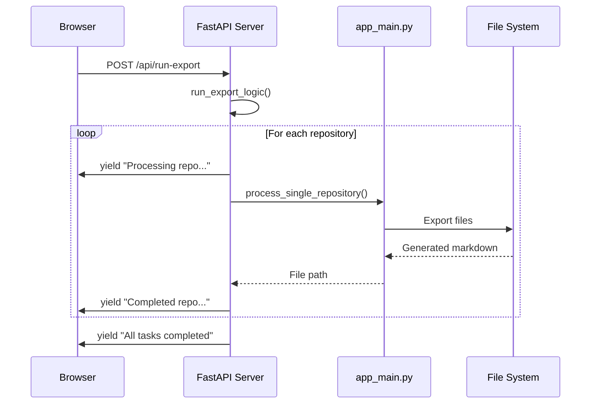

# Technical Implementation

## Export Process Implementation

### File Processing Pipeline

```mermaid
flowchart TD
    Start[export_folder_content(path)] --> Parse[parse_ignore_file(path)]
    Parse --> Walk[os.walk(path)]
    Walk --> FilterDirs[Filter directories<br/>dirs[:] = filtered]
    FilterDirs --> ProcessFiles[Process each file]
    ProcessFiles --> Check{should_include_item?}
    Check -->|Yes| Read[Read file content]
    Check -->|No| Skip[Skip file]
    Read --> Encode{Encoding check}
    Encode -->|UTF-8| Format[Format as markdown]
    Encode -->|Binary| Binary[Mark as binary]
    Format --> Append[Append to content]
    Binary --> Append
    Skip --> Next{More files?}
    Append --> Next
    Next -->|Yes| ProcessFiles
    Next -->|No| Return[Return joined content]
    
    style Start fill:#e3f2fd
    style Parse fill:#f3e5f5
    style Check fill:#fff3e0
    style Encode fill:#ffebee
    style Return fill:#e8f5e8
```

```python
# Core processing flow in folder_exporter.py
def export_folder_content(path):
    spec = parse_ignore_file(path)  # Load .exportignore patterns
    content = []
    
    for root, dirs, files in os.walk(path):
        # Filter directories in-place to skip ignored paths
        dirs[:] = [d for d in dirs if should_include_item(path, spec)]
        
        for file in files:
            if should_include_item(rel_path, spec):
                # Process file content with encoding fallback
                # Format as markdown code blocks
```

### Tree Visualization Implementation

```mermaid
graph TD
    Start[build_tree(path, root_path, spec)] --> CreateRoot[Create root Node]
    CreateRoot --> AddChildren[add_children(path, root_node)]
    AddChildren --> ListDir[os.listdir(current_path)]
    ListDir --> Separate[Separate dirs and files]
    Separate --> FilterDirs[Filter dirs with should_include_item]
    FilterDirs --> FilterFiles[Filter files with should_include_item]
    FilterFiles --> ProcessDirs[Create Node for each directory]
    ProcessDirs --> Recurse[Recursively call add_children]
    Recurse --> ProcessFiles[Create Node for each file]
    ProcessFiles --> RenderTree[RenderTree for output]
    RenderTree --> Return[Return formatted string]
    
    style Start fill:#e3f2fd
    style CreateRoot fill:#f3e5f5
    style FilterDirs fill:#fff3e0
    style FilterFiles fill:#fff3e0
    style Recurse fill:#ffebee
    style Return fill:#e8f5e8
```

Uses `anytree` for hierarchical structure representation:

```python
# tree_visualizer.py core algorithm
def build_tree(path, root_path, spec):
    root_node = Node(basename + '/')
    
    def add_children(current_path, current_node):
        # Recursive directory traversal
        # Filter based on ignore patterns
        # Build tree structure with files and directories
```

### Ignore Pattern System

```mermaid
flowchart TD
    Start[parse_ignore_file(directory)] --> Default[Load DEFAULT_IGNORE_PATTERNS]
    Default --> Check{.exportignore exists?}
    Check -->|Yes| Read[Read .exportignore file]
    Check -->|No| Combine[Use defaults only]
    Read --> Parse[Parse each line]
    Parse --> Skip{Line empty or comment?}
    Skip -->|Yes| NextLine[Next line]
    Skip -->|No| Add[Add pattern to list]
    Add --> NextLine
    NextLine --> More{More lines?}
    More -->|Yes| Parse
    More -->|No| Combine
    Combine --> PathSpec[PathSpec.from_lines<br/>GitWildMatchPattern]
    PathSpec --> Return[Return PathSpec object]
    
    style Start fill:#e3f2fd
    style Check fill:#fff3e0
    style Skip fill:#fff3e0
    style PathSpec fill:#ffebee
    style Return fill:#e8f5e8
```

Implements gitignore-style pattern matching:

```python
# ignore_parser.py pattern matching
def parse_ignore_file(directory):
    patterns = DEFAULT_IGNORE_PATTERNS.copy()
    # Load .exportignore if exists
    # Combine with defaults
    return PathSpec.from_lines(GitWildMatchPattern, patterns)
```

## Interface Implementations

### CLI Interface (`src/export_for_ai/main.py`)

Single-directory export with structured output:

```python
def main():
    directory_path = parse_arguments()
    export_dir, folder_name = create_export_directory(directory_path)
    
    # Generate tree structure
    tree_structure = export_tree_structure(directory_path)
    
    # Export content
    folder_contents = export_folder_contents(directory_path)
    
    # Combine into final markdown
    export_project_md(tree_structure, folder_contents, export_dir, folder_name)
```

### Web Interface (`web_ui.py`)



FastAPI-based server with streaming responses:

```python
# Real-time log streaming
async def run_export_logic(config: Config) -> AsyncGenerator[str, None]:
    for repo_path in repositories:
        yield f"data: Processing repository: {repo_path}\n\n"
        md_file_path = await asyncio.to_thread(
            app_main.process_single_repository, repo_path
        )
        # Stream progress updates
```

### System Tray Interface (`systray_app.py`)

```mermaid
graph TB
    Start[systray_app.py main()] --> CreateIcon[Create system tray icon]
    CreateIcon --> SetupHotkeys[Setup global hotkeys<br/>Ctrl+Shift+Q/E]
    SetupHotkeys --> StartThreads[Start background threads]
    
    StartThreads --> WebThread[Web Server Thread<br/>uvicorn.Server]
    StartThreads --> HotkeyThread[Hotkey Listener Thread<br/>pynput.GlobalHotKeys]
    StartThreads --> IconThread[System Tray Thread<br/>pystray.Icon.run]
    
    HotkeyThread --> OpenUI[Ctrl+Shift+Q<br/>open_ui()]
    HotkeyThread --> RunExport[Ctrl+Shift+E<br/>on_export_activate()]
    
    OpenUI --> Browser[Open browser to<br/>http://127.0.0.1:8000]
    RunExport --> ExportThread[Background export<br/>run_export_and_open_folder()]
    
    style Start fill:#e3f2fd
    style CreateIcon fill:#f3e5f5
    style SetupHotkeys fill:#fff3e0
    style WebThread fill:#ffebee
    style HotkeyThread fill:#e8f5e8
    style IconThread fill:#fce4ec
```

Background service with hotkey integration:

```python
def main():
    # Create system tray icon
    icon = pystray.Icon("export_for_ai", icon_image, "Export for AI", menu)
    
    # Setup global hotkeys
    hotkeys = {
        '<ctrl>+<shift>+q': open_ui,
        '<ctrl>+<shift>+e': on_export_activate
    }
    
    # Run in background threads
    listener_thread = threading.Thread(target=run_hotkey_listener)
    icon.run()
```

## Content Generation

### Markdown Structure

Generated files follow consistent structure:

```markdown
# Previous step

# The goal  

# Core Design Philosophy
[Template content with development principles]

# SolutionTreeView
```
[Directory tree visualization]
```

# Entire Solution Code start
[All file contents with headers]
# EntireSolution Code end
```

### Code Minification

Selective content reduction in `minify_code()`:

```python
def minify_code(content):
    # Remove single-line comments: #.*
    # Remove multi-line comments: '''...''' or """..."""
    # Remove excessive whitespace
    # Preserve code structure
```

## Configuration Management

### JSON Configuration Schema

```python
class Config(BaseModel):
    export_destination: str
    repositories: List[str]
    assets_to_copy: Optional[List[str]] = []
```

### Default Ignore Patterns

Comprehensive exclusion list in `ignore_parser.py`:
- Python artifacts: `__pycache__/`, `*.py[cod]`, `*.egg-info/`
- Build outputs: `build/`, `dist/`, `target/`
- IDE files: `.vscode/`, `.idea/`
- Version control: `.git/`, `.DS_Store`
- Media files: `*.jpg`, `*.png`, `*.svg`
- Documentation: `*.md`, `*.txt`

## Error Handling Implementations

### File Processing Errors

```python
try:
    with open(file_path, "r", encoding="utf-8") as f:
        file_content = f.read()
except UnicodeDecodeError as e:
    # Handle binary files
    content.append(f"# File: {rel_file_path}\n")
    content.append("`Binary or unreadable file`\n\n")
```

### Network Error Handling

```python
# web_ui.py error handling
try:
    response = await fetch('/api/run-export', config)
    # Process streaming response
except Exception as error:
    logLine.textContent = `[UI-ERROR] Failed to connect: ${error.message}`;
```

### System Tray Error Recovery

```python
# systray_app.py crash protection
try:
    main()
except Exception:
    logging.critical("An unhandled exception occurred!")
    log_crash(sys.exc_info())
```

## Performance Optimizations

### Asynchronous Processing

Web interface uses asyncio for non-blocking operations:

```python
# Async file operations
md_file_path = await asyncio.to_thread(
    app_main.process_single_repository, repo_path
)
```

### Memory Management

- Streaming file processing prevents loading entire codebases into memory
- Temporary directory cleanup after export completion
- Efficient tree traversal with in-place directory filtering

### Background Processing

System tray operations run in daemon threads:

```python
export_thread = threading.Thread(target=run_export_and_open_folder)
export_thread.daemon = True
export_thread.start()
```

## Integration Points

### Clipboard Integration

Automatic content copying using `pyperclip`:

```python
try:
    pyperclip.copy(content)
    logging.info("Content successfully copied to clipboard")
except Exception as e:
    logging.warning(f"Could not copy to clipboard: {e}")
```

### File System Integration

- Automatic export directory creation
- Platform-specific path handling
- File system permission management

### Desktop Integration

- System tray icon with native menu
- Global hotkey registration
- Browser integration for web UI opening